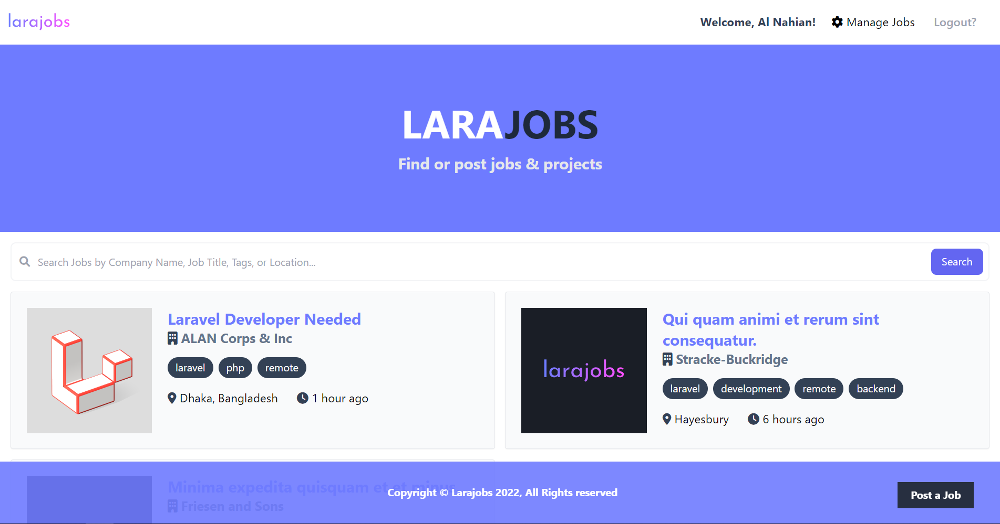

<p align="center"><a href="https://github.com/alnahian2003/larajobs" target="_blank"></a></p>

<p align="center"><a href="https://github.com/alnahian2003" target="_blank"></a></p>

# Larajobs (Fictional Job Portal)

Larajobs is a very simple micro job listing platform inspired by the [Brad Traversy's Laragigs project](https://youtu.be/MYyJ4PuL4pY).

## Installation

Please check the official laravel installation guide for server requirements before you start. [Official Documentation](https://laravel.com/docs/master/installation)

Install my-project with npm

```bash
git clone https://github.com/alnahian2003/larajobs.git
```

Switch to the repo folder

```
cd larajobs
```

Install all the dependencies using composer and npm

```
composer install
```
```
npm install
```

Copy the example env file and make the required configuration changes in the .env file

```
cp .env.example .env
```

Generate a new application key

```
php artisan key:generate
```

Create a symbolic link from `public/storage` to `storage/app/public`

```
php artisan storage:link
```

Run the database migrations (Set the database connection in .env before migrating)

```
php artisan migrate
```

Start the local development server

```
php artisan serve
```

Start Vite for bundling the assets (required)

```
npm run dev
```

You can now access the server at http://localhost:8000

### TL;DR

Command list

```
git clone https://github.com/alnahian2003/larajobs.git

cd larajobs

composer install

npm install

cp .env.example .env

php artisan key:generate

php artisan storage:link

php artisan migrate

php artisan serve
npm run dev
```

Make sure you set the correct database connection information before running the migrations Environment variables

```
php artisan migrate
php artisan serve
```

## Database Seeding

Populate the database with seed data with relationships which includes users and jobs. This can help you to quickly start testing the frontend and start using it with ready content.

Run the database seeder and you're done

```
php artisan db:seed
```

Note : It's recommended to have a clean database before seeding. You can refresh your migrations at any point to clean the database by running the following command

```
php artisan migrate:refresh
```

## Tech Stack

**Client:** TailwindCSS, AlpineJS

**Server:** PHP, Laravel

## Note

Before giving this repo the name 'larajobs', I had no idea that a platform called Larajobs really does exists! So, I had no intention to steal their idea or something. It was just a random naming convention that popped outta my head from nowhere.

Please don't call the cops, [Larajobs](https://larajobs.com) 😭 (Ah, yes, I'm kidding 😛)

## Support

For support, [contact me](https://alnahian2003.github.io#contact) or pull a issue.
